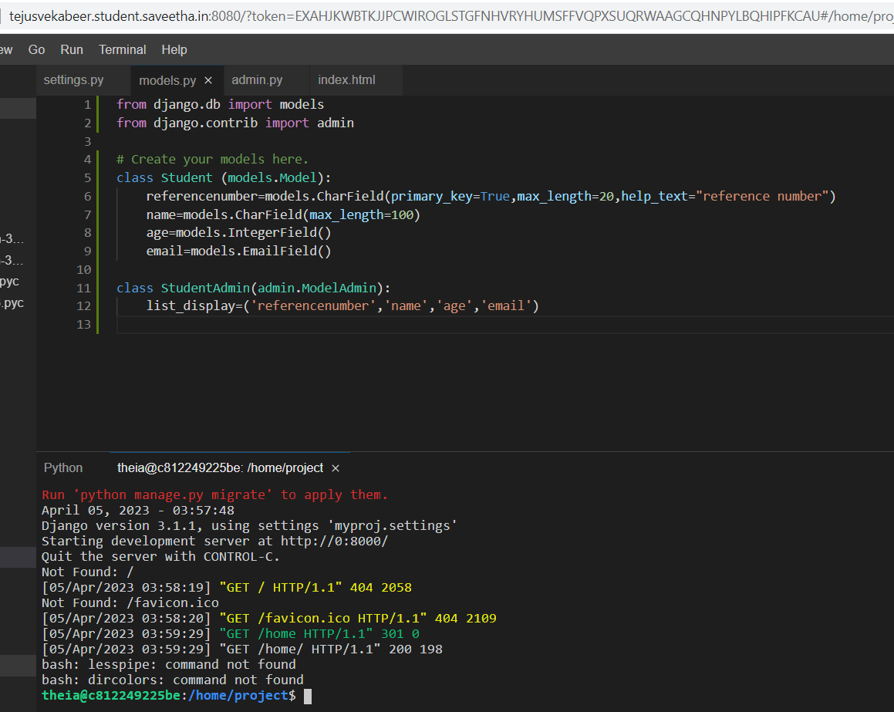
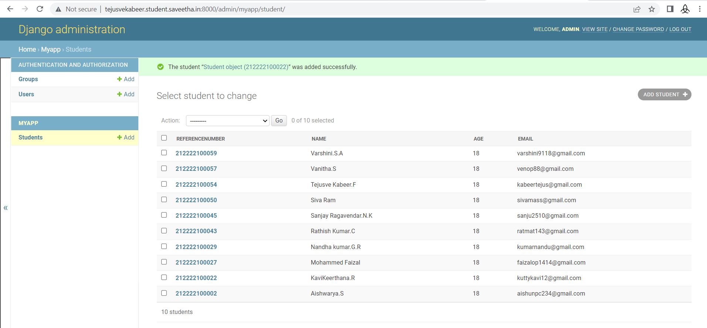

# Django ORM Web Application

## AIM
To develop a Django application to store and retrieve data from a database using Object Relational Mapping(ORM).

## DESIGN STEPS

### STEP 1:

Clone the experiment from github.

### STEP 2:

Enter the appropriate code at models.py and admins.py.

### STEP 3:

Create django and add student details.

## PROGRAM

### html
```html
<!DOCTYPE html>
<html>
    <head></head>
    <body>
        <h1>
            Welcome to Saveetha Engineering College
        </h1>
    </body>
</html>
```
### models.py
```python
from django.db import models
from django.contrib import admin

class Student (models.Model):
    referencenumber=models.CharField(primary_key=True,max_length=20,help_text="reference number")
    name=models.CharField(max_length=100)
    age=models.IntegerField()
    email=models.EmailField()

class StudentAdmin(admin.ModelAdmin):
    list_display=('referencenumber','name','age','email')
```
### admin.py
```python
from django.contrib import admin
from .models import Student,StudentAdmin

admin.site.register(Student,StudentAdmin)
```

## OUTPUT

### serveroutput



### clientoutput



## RESULT

Thus the Experiment has been executed successfully.
